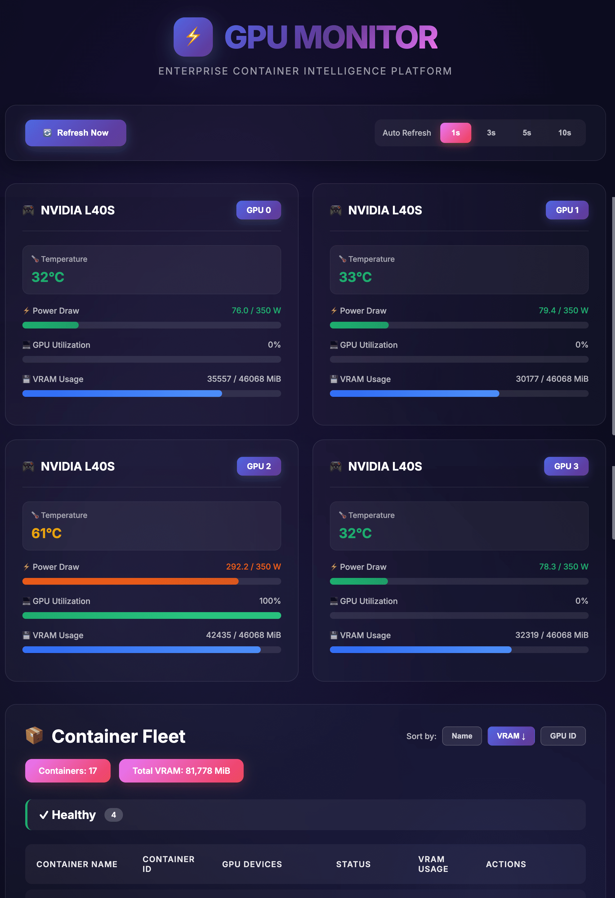

# 🚀 GPU コンテナモニター

[](https://opensource.org/licenses/MIT)
[](https://www.python.org/downloads/)
[](https://www.docker.com/)

> GPU対応Dockerコンテナのための美しいリアルタイム監視ダッシュボードと包括的な管理機能。

[English](README.md) | [简体中文](README.zh-CN.md) | [繁體中文](README.zh-TW.md) | [日本語](README.ja.md)

## 📸 ダッシュボードプレビュー



*リアルタイム GPU モニタリング、美しくモダンなインターフェース - 温度、消費電力、使用率、VRAM 使用状況を一目で確認*

## ✨ 機能

- 🎮 **リアルタイムGPU監視** - すべてのNVIDIA GPUのライブメトリクスを監視
  - GPU使用率とメモリ使用量
  - 温度と消費電力
  - 読みやすい視覚的なプログレスバー
  
- 📦 **コンテナ管理** - GPU対応コンテナの完全な制御
  - コンテナの起動、停止、一時停止、再起動
  - 色分けされたインジケーターでコンテナの状態を表示
  - 各コンテナが使用しているGPUを確認
  
- 🎨 **美しいUI** - モダンでレスポンシブなWebインターフェース
  - グラデーションカラーテーマ
  - リアルタイム更新（1秒/3秒/5秒/10秒間隔）
  - クイックリファレンス用のステータス凡例
  - モバイルフレンドリーなデザイン
  
- 🔄 **2つのデプロイオプション**
  - Systemdサービス（軽量）
  - Dockerコンテナ（分離環境）
  
- 🌐 **多言語対応** - 英語、簡体字中国語、繁体字中国語、日本語

## 📋 前提条件

インストール前に、以下を確認してください：

### 必須項目

- **オペレーティングシステム**：Linux（Ubuntu 20.04+、Debian 11+、または同等）
- **NVIDIA GPU**：1つ以上のNVIDIA GPU
- **NVIDIAドライバ**：バージョン450.80.02以上
- **nvidia-smi**：NVIDIAシステム管理インターフェース
- **Docker**：バージョン20.10+とNVIDIA Container Toolkit
- **Python**：バージョン3.8以上

### クイックチェック

このコマンドを実行してシステムを確認：

```bash
# NVIDIAドライバとGPUを確認
nvidia-smi

# Dockerを確認
docker --version

# Pythonを確認
python3 --version

# NVIDIA Container Toolkitを確認
docker run --rm --gpus all nvidia/cuda:11.0-base nvidia-smi
```

### 前提条件のインストール

<details>
<summary><b>Ubuntu/Debian</b></summary>

```bash
# NVIDIAドライバをインストール（未インストールの場合）
sudo apt update
sudo apt install nvidia-driver-535

# Dockerをインストール
curl -fsSL https://get.docker.com -o get-docker.sh
sudo sh get-docker.sh

# NVIDIA Container Toolkitをインストール
distribution=$(. /etc/os-release;echo $ID$VERSION_ID)
curl -s -L https://nvidia.github.io/nvidia-docker/gpgkey | sudo apt-key add -
curl -s -L https://nvidia.github.io/nvidia-docker/$distribution/nvidia-docker.list | \
  sudo tee /etc/apt/sources.list.d/nvidia-docker.list

sudo apt-get update
sudo apt-get install -y nvidia-container-toolkit
sudo systemctl restart docker

# PythonとPipをインストール
sudo apt install python3 python3-pip

# Flaskをインストール
pip3 install flask
```

</details>

<details>
<summary><b>CentOS/RHEL</b></summary>

```bash
# NVIDIAドライバをインストール
sudo yum install nvidia-driver

# Dockerをインストール
sudo yum install -y yum-utils
sudo yum-config-manager --add-repo https://download.docker.com/linux/centos/docker-ce.repo
sudo yum install docker-ce docker-ce-cli containerd.io

# NVIDIA Container Toolkitをインストール
distribution=$(. /etc/os-release;echo $ID$VERSION_ID)
curl -s -L https://nvidia.github.io/nvidia-docker/$distribution/nvidia-docker.repo | \
  sudo tee /etc/yum.repos.d/nvidia-docker.repo

sudo yum install -y nvidia-container-toolkit
sudo systemctl restart docker

# PythonとPipをインストール
sudo yum install python3 python3-pip

# Flaskをインストール
pip3 install flask
```

</details>

## 🚀 クイックスタート

### オプション1：Systemdサービス（本番環境推奨）

```bash
# リポジトリをクローン
git clone https://github.com/neosun100/gpu-container-monitor.git
cd gpu-container-monitor

# systemdサービスをインストール
sudo cp gpu-monitor.service /etc/systemd/system/
sudo systemctl daemon-reload
sudo systemctl enable gpu-monitor
sudo systemctl start gpu-monitor

# ステータスを確認
sudo systemctl status gpu-monitor
```

**アクセス**：http://your-server-ip:5000

### オプション2：Dockerコンテナ

```bash
# リポジトリをクローン
git clone https://github.com/neosun100/gpu-container-monitor.git
cd gpu-container-monitor

# クイックスタート
./start-docker.sh

# または手動で起動
docker-compose up -d

# ログを確認
docker-compose logs -f
```

**アクセス**：http://your-server-ip:5001

### オプション3：手動実行（開発環境）

```bash
# リポジトリをクローン
git clone https://github.com/neosun100/gpu-container-monitor.git
cd gpu-container-monitor

# 依存関係をインストール
pip3 install flask

# 実行
python3 app.py
```

**アクセス**：http://your-server-ip:5000

## 📖 使用方法

### Webインターフェース

1. ブラウザで `http://your-server-ip:5000`（Dockerバージョンは5001）にアクセス
2. 上部でリアルタイムGPUメトリクスを表示
3. 下部のテーブルでコンテナを管理
4. 必要に応じて更新間隔を調整（1秒/3秒/5秒/10秒）

### コンテナ操作

- **▶ 起動**：停止したコンテナを起動
- **⏸ 一時停止**：実行中のコンテナを一時停止（プロセスを凍結）
- **▶ 再開**：一時停止したコンテナを再開
- **🔄 再起動**：コンテナを再起動
- **⏹ 停止**：実行中のコンテナを停止

### ステータスカラー

- 🟢 **健全実行中**（濃い緑）- コンテナが正常に実行され、ヘルスチェックに合格
- 🟢 **実行中**（緑）- コンテナが正常に実行中
- 🟠 **一時停止中**（オレンジ）- コンテナが一時停止中
- 🟡 **再起動中**（黄色）- コンテナが再起動中
- 🔴 **停止**（赤）- コンテナが停止
- ⚪ **未起動**（グレー）- コンテナは作成されているが起動していない

## 🔧 設定

### Systemdサービス

`/etc/systemd/system/gpu-monitor.service`を編集：

```ini
[Unit]
Description=GPU Container Monitor Service
After=network.target docker.service

[Service]
Type=simple
User=your-username
WorkingDirectory=/path/to/gpu-container-monitor
ExecStart=/usr/bin/python3 /path/to/gpu-container-monitor/app.py
Restart=always
RestartSec=10

[Install]
WantedBy=multi-user.target
```

### Docker Compose

`docker-compose.yml`を編集：

```yaml
version: '3.8'

services:
  gpu-monitor:
    build: .
    container_name: gpu-container-monitor
    ports:
      - "5001:5000"  # ここでポートを変更
    volumes:
      - /var/run/docker.sock:/var/run/docker.sock:ro
    deploy:
      resources:
        reservations:
          devices:
            - driver: nvidia
              count: all
              capabilities: [utility]
    restart: unless-stopped
```

## 🛠️ 管理コマンド

### Systemdサービス

```bash
# サービスを起動
sudo systemctl start gpu-monitor

# サービスを停止
sudo systemctl stop gpu-monitor

# サービスを再起動
sudo systemctl restart gpu-monitor

# ステータスを表示
sudo systemctl status gpu-monitor

# ログを表示
sudo journalctl -u gpu-monitor -f

# 起動時の自動起動を有効化
sudo systemctl enable gpu-monitor

# 起動時の自動起動を無効化
sudo systemctl disable gpu-monitor
```

### Dockerコンテナ

```bash
# コンテナを起動
docker-compose up -d

# コンテナを停止
docker-compose down

# コンテナを再起動
docker-compose restart

# ログを表示
docker-compose logs -f

# イメージを再ビルド
docker-compose build

# コンテナのステータスを表示
docker-compose ps
```

## 🐛 トラブルシューティング

<details>
<summary><b>GPUが検出されない</b></summary>

```bash
# NVIDIAドライバを確認
nvidia-smi

# NVIDIA Container Toolkitを確認
docker run --rm --gpus all nvidia/cuda:11.0-base nvidia-smi

# Dockerを再起動
sudo systemctl restart docker
```

</details>

<details>
<summary><b>コンテナが表示されない</b></summary>

```bash
# Docker socketの権限を確認
ls -l /var/run/docker.sock

# ユーザーにDocker権限があることを確認
sudo usermod -aG docker $USER

# サービスを再起動
sudo systemctl restart gpu-monitor
```

</details>

<details>
<summary><b>ポートが既に使用されている</b></summary>

```bash
# ポートを使用しているプロセスを確認
sudo lsof -i :5000

# 設定でポートを変更
# Systemd：app.pyを編集
# Docker：docker-compose.ymlを編集
```

</details>

<details>
<summary><b>サービスの起動に失敗する</b></summary>

```bash
# ログを確認
sudo journalctl -u gpu-monitor -n 50

# Python依存関係を確認
pip3 install flask

# ファイルの権限を確認
ls -l /path/to/gpu-container-monitor/app.py
```

</details>

## 📊 アーキテクチャ

```
┌─────────────────────────────────────────────────────────────┐
│                  Webブラウザ（ポート 5000/5001）             │
└────────────────────────┬────────────────────────────────────┘
                         │
                         ▼
┌─────────────────────────────────────────────────────────────┐
│                   Flask Webアプリケーション                 │
│  ┌──────────────┐  ┌──────────────┐  ┌──────────────┐     │
│  │  GPU情報     │  │  コンテナ    │  │  制御        │     │
│  │  コレクター  │  │  マネージャー│  │  API         │     │
│  └──────────────┘  └──────────────┘  └──────────────┘     │
└────────┬────────────────────┬────────────────────┬─────────┘
         │                    │                    │
         ▼                    ▼                    ▼
┌─────────────────┐  ┌─────────────────┐  ┌─────────────────┐
│   nvidia-smi    │  │  Docker Socket  │  │  Docker CLI     │
└─────────────────┘  └─────────────────┘  └─────────────────┘
         │                    │                    │
         ▼                    ▼                    ▼
┌─────────────────────────────────────────────────────────────┐
│                      ホストシステム                          │
│  ┌──────────┐  ┌──────────┐  ┌──────────┐  ┌──────────┐  │
│  │  GPU 0   │  │  GPU 1   │  │  GPU 2   │  │  GPU 3   │  │
│  └──────────┘  └──────────┘  └──────────┘  └──────────┘  │
│  ┌──────────────────────────────────────────────────────┐  │
│  │           GPUアクセス権限を持つDockerコンテナ       │  │
│  └──────────────────────────────────────────────────────┘  │
└─────────────────────────────────────────────────────────────┘
```

## 🤝 貢献

貢献を歓迎します！プルリクエストをお気軽に送信してください。

1. リポジトリをフォーク
2. 機能ブランチを作成（`git checkout -b feature/AmazingFeature`）
3. 変更をコミット（`git commit -m 'Add some AmazingFeature'`）
4. ブランチにプッシュ（`git push origin feature/AmazingFeature`）
5. プルリクエストを開く

## 📝 ライセンス

このプロジェクトはMITライセンスの下でライセンスされています - 詳細は[LICENSE](LICENSE)ファイルを参照してください。

## 🙏 謝辞

- [Flask](https://flask.palletsprojects.com/)で構築
- [nvidia-smi](https://developer.nvidia.com/nvidia-system-management-interface)によるGPU監視
- [Docker](https://www.docker.com/)によるコンテナ管理

## 📧 お問い合わせ

- GitHub：[@neosun100](https://github.com/neosun100)
- 問題報告：[GitHub Issues](https://github.com/neosun100/gpu-container-monitor/issues)

## 📱 フォローする

<div align="center">
  
  <p><strong>👆 スキャンしてフォロー、より多くの素晴らしいコンテンツを入手</strong></p>
  <p>このプロジェクトや他のプロジェクトの最新情報をいち早く入手！</p>
</div>

## ⭐ Star履歴

このプロジェクトが役に立つと思ったら、ぜひスターを付けてください！

---

GPUコンピューティングコミュニティのために ❤️ で作成
